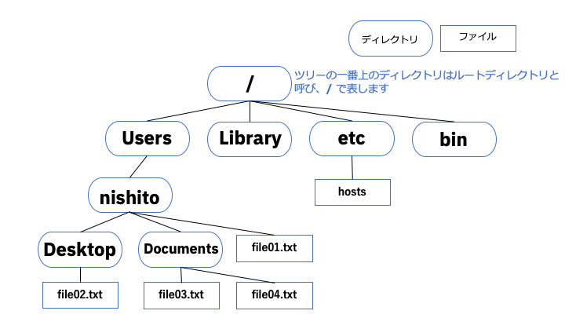
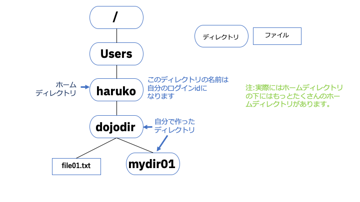

# Dojo Basic: Lab1-1 コマンドの基礎

## 目的とゴール
### 目的
 - Macで実行可能シェルコマンドの基本について学びます。

### ゴール
 - 一般的なコマンドが使えるようになる

## このLabの実施前提
- Mac のターミナル
  - コマンドはBourne Shell 互換シェル(bash, zshなど)で動く基本的なコマンドとなりますので、動作環境が異なってもBourne Shell 互換シェルであれば、Mac固有の操作以外は実施可能です。


# 1. コマンドの基礎
## 1.1 コマンドとは
**コマンド**とはコピューターを操作するために「ターミナル」(Mac)や　「コマンドプロンプト」(Windows)を使って行える、決められた文字列のことです(回りくどい言い方ですね、、、）。例えばファイル一覧を表示したい場合はMacでは`ls` という決められた文字列、つまり**コマンド**をターミナルから入力し、enterキーを押せば、`ls`という**コマンド**がMacで実行され、結果がターミナルに表示されます。

まずは**コマンド**を実行する(コンピュータに操作を伝える)ためにはは最後にenterキーを押す事は覚えておきましょう。なんとなく知っているとは思いますが、、、、。

最近はGUI(Graphical User Interface)が主流で、マウス操作でPCを操作できるようになっています。それに対して**コマンド**はターミナルにコマンドを入力して操作するので、CUI(Command User Interface)操作と呼ばれます。

## 1.2 ターミナルの開き方(Mac)とプロンプト
まずはターミナルを開きます。
以下のリンクを参照してください:

https://support.apple.com/ja-jp/guide/terminal/apd5265185d-f365-44cb-8b09-71a064a42125/2.10/mac/10.15

バージョンを選択で自分のOSのバージョンを指定してください。

ターミナルを開くと、画面左側に`%`あるいは`$`で終わる文字列が表示されています。この記号はプロンプトと呼びます。このプロンプトはコマンド入力が可能な状態になっている時に表示されます。

macOSのバージョンがMojaveの場合(Bash)の例:
```
server1:~ dev01$
``` 
これは、dev01 というユーザが、server1 というコンピュータにログインしていて、現在のフォルダはホームフォルダ（~で示されています）であることを示しています。

macOSのバージョンCaralinaが場合(zsh)の例:
```
dev02@MacBook-Pro ~ %
``` 
これは、dev02というユーザが、MacBook-Proというコンピュータにログインしていて、現在のフォルダはホームフォルダ（~で示されています）であることを示しています。

プロンプロト前の情報は変更可能です（ここでは扱いません)。

フォルダについては後ほど説明します。


 ## 1.3 コマンドのおやくそく

**コマンド**は必ず半角英数字になります。基本コマンドに至っては必ず小文字です。英語の小文字を打ったのにと思っても、全角ではコンピュータには通じません。必ず半角を確認しましょう。

**コマンド**は必要に応じてそのあとに引数(読み方は「ひきすう」)を入力します。引数はパラメータということもあります。引数は**コマンド**を実行する際に必要な情報を指定するためにつけます。例えばファイル名などです。引数の一部としてコマンドオプションという、**コマンド**特有の情報用に決まった文字列が決められているものがあります。

- 例
   ```
   ls -l *.txt
   ```
   - この場合`ls`がコマンド、`-l`と`*.txt`の2つが引数です。
   - `-l`はコマンドオプションです。`ls`というコマンドでコマンドオプションは決まっています。コマンドオプションに対して引数が必要な場合もあります。
   - **コマンド**と引数の間には必ず**半角スペース**を1つ以上入れます。
   - 引数はファイル名など固有なものを除いて、**必ず半角英数字**です。

## 1.2 標準入力と標準出力

**標準入力**とはキーボードからの入力をいいます。

**標準出力**とはコマンドの実行結果が表示される画面(=ターミナル)をいいます。

## 1.3 コマンド入力で困った時 

- コマンドを実行後、 キーボードの入力は画面に表示されるが、プロンプトが表示されない
   - コマンド実行後に標準入力が必要なタイプのコマンドと想定されます。よくわからなくなった場合は **\[control\]+\[d\]** を入力して、標準入力を終了します。( **\[control\]+\[d\]** とは **\[control\]** キーと **\[d\]** のキーを同時に入力(押下)することです）

- コマンドを実行後、 キーボードの入力は画面に表示されず、プロンプトも表示されない
   - コマンド実行中であると考えられます。あるいは暴走(!)しているのかもしれません。途中で強制終了したい場合は **[control]+[c]** を入力して、標準入力を終了します。コマンドが強制終了されます。

- ターミナルの表示を消したいとき
  ```sh 
  clear 
  ``` 
  というコマンドを入力し、実行します。


# ２. ディレクトリ(フォルダ)
GUIではフォルダアイコンでおなじみ、ファイルを入れておく入れ物のことを、MacやWindowsではフォルダと言うのはご存知かと思います。

**ディレクトリ**はUnix系のOSでファイルを入れておく入れ物の呼び方です。つまりどちらも同じものです（厳密には違いがありますが、当Labでは違いが出るほどの内容は含んでいません）。

今回の内容のBourne Shell 互換シェルのコマンドでは`rmdir`など**ディレクトリ**に由来するコマンドもありますので、今後は**ディレクトリ**で統一して説明します。

**ディレクトリ**は名前で管理します。

## 2.1 ディレクトリのツリー構造・絶対パス

**ディレクトリ**は**ディレクトリ**の中に**ディレクトリ**を作ることができます。

**ディレクトリ**は下図のようにツリー構造になります。ツリーの一番上のディレクトリは**ルートディレクトリ**と呼び、**/** で表します。

図2.1:


**ディレクトリ**あるいはファイルを、ルートから/で区切って表したものを**絶対パス**と言います。ディレクトリやファイルがツリー構造のどこにあるか表すものとなります。
図2.1でファイルfile01.txtの絶対パスは
```
/Users/haruko/file01.txt
```
となります。
図2.1でディレクトリDesktopの絶対パスは
```
/Users/haruko/Desktop
```
となります。

ツリー構造で1つ上のディレクトリは**親ディレクトリ**、1つ下のディレクトリは**子ディレクトリ**と呼びます。

図2.1でディレクトリharukoの**親ディレクトリ**は**Users**、**子ディレクトリ**は**Desktop**、**Documents**の2つになります。

## 2.2 ホームディレクトリ・カレントディレクトリ・相対パス
**ホームディレクトリ**は1ユーザーに1つ与えられたそのユーザー用のディレクトリです。Macでは通常 **/Users/\[ログインid\]** が割り当てられます。Macではターミナルを開いたときの**カレントディレクトリ**になります。

**カレントディレクトリ**とは、コマンドで作業を実行する場所になります(または**ワーキンングディレクトリ**という場合もあります)。
自分は今どこのディレクトリにいるかは、`pwd` コマンドで表示できます。
開いてあるターミナルに以下のコマンドを入力し、実行してください。
```sh
pwd
```
出力例:
```sh
~:$ pwd
/Users/haruko
```

pwdはPrint Working Directoryの略です。

### 相対パス
**相対パス**は通常は**カレントディレクトリ**からのパスの指定方法です。あるいは**ホームディレクトリ**からの指定も可能です。

相対パスの指定方法には記号を使用した方法があります:
- **カレントディレクトリ**は **\.**(ドット1つ)
- **カレントディレクトリ**の**親ディレクトリ**は **\.\.**(ドット2つ)
- 自分の**ホームディレクトリ**は **~**(チルダ)
- ログインid nagisa　の**ホームディレクトリ**は **~nagisa**(チルダ+ログインid)

例えば図2.1で**ホームディレクトリ** harukoにいたとすると：
- **親ディレクトリ**Usersは **\.\.**(ドット2つ)
- **親ディレクトリ**Usersは **~/\.\.**(チルダ+/+ドット2つ)
- ルートディレクトリは2階層上なので **\.\./\.\.**
- ディレクトリ /Users/nagisaは **~nagisa**(チルダ+ログインid)
- ディレクトリ /Usersは **~nagisa/\.\.**(チルダ+ログインid+/+ドット2つ)

のように色々な相対パスで表せます。


## 2.3 ディレクトリの作成とカレントディレクトリの変更
自分のディレクトリを作成してみましょう。
`mkdir [ディレクトリ名]`　で作成できます。
ターミナルに以下のコマンドを入力し、実行してください。
```sh
mkdir dojodir
```
図2.3:


作成できたか確認します。
`ls`　で、**カレントディレクトリ**にあるディレクトリとファイルがリストできます。
ターミナルに以下のコマンドを入力し、実行してください。
```sh
ls
```
表示されたディレクトリの中に**dojodir**があったと思います。

**カレントディレクトリ**を作成した**dojodir**に変更しましょう。
**カレントディレクトリ**を変更するコマンドは`cd [変更先の相対パスまたは絶対パス]`です。
ターミナルに以下のコマンドを入力し、実行してください。
```sh
cd dojodir
```
これで**カレントディレクトリ**が**dojodir**に変更されました。**dojodir**は相対パスです。確認してみましょう。
ターミナルに以下のコマンドを入力し、実行してください。
```sh
pwd
```
出力例:
```sh
~:$ pwd
/Users/haruko/dojodir
```
「haruko」の部分は自分のログインidとなります。


自分の**ホームディレクトリ**に**カレントディレクトリ**を変更するには、 `cd`とだけコマンド入力します。
ターミナルに以下のコマンドを入力し、実行してください。
```sh
cd
```
パスを確認してみましょう。
ターミナルに以下のコマンドを入力し、実行してください。
```sh
pwd
```
出力例:
```sh
~:$ pwd
/Users/haruko
```
「haruko」の部分は自分のログインidとなります。

/Users に**カレントディレクトリ**を変更します。
ターミナルに以下のコマンドを入力し、実行してください。
```sh
cd ..
```
相対パスでの指定で、1つ上に上がるので、**\.\.** になります。
絶対パスの場合は
```sh
cd /Users
```
になります。
パスを確認してみましょう。
ターミナルに以下のコマンドを入力し、実行してください。
```sh
pwd
```
出力例:
```sh
~:$ pwd
/Users
```

作成した**dojodir**に**カレントディレクトリ**を変更します。

絶対パスで指定します。「haruko」の部分は自分のログインidに変更してください。
ターミナルに以下のコマンドを入力し、実行してください。
```sh
cd /User/haruko/dojodir
```
パスは他には
`haruko/dojodir`(相対パス、「haruko」の部分は自分のログインidに変更してください)、`~/dojodir` (相対パス)で入力することができます。
パスを確認してみましょう。
ターミナルに以下のコマンドを入力し、実行してください。
```sh
pwd
```
出力例: 「haruko」の部分は自分のログインidとなります。
```sh
~:$ pwd
/Users/haruko/dojodir
```

最後にディレクトリを削除してみましょう。

まずは削除用に新しいディレクトリを作ります。ターミナルに以下のコマンドを入力し、実行してください。
```sh
mkdir deldir
```

`ls`コマンドで確認します。ターミナルに以下のコマンドを入力し、実行してください。
```sh
ls
```

出力例: 
```sh
~/dojodir:$ ls
deldir	
~/dojodir:$ 
```

ディレクトリの削除は`rmdir [ディレクトリ名]`　でできます。ターミナルに以下のコマンドを入力し、実行してください。
```sh
rmdir deldir
```
尚、`rmdir` はオプションをつけない場合は、ディレクトリの中が空でないとエラーになります。

`ls`コマンドで確認します。ターミナルに以下のコマンドを入力し、実行してください。
```sh
ls
```

出力例: 
```sh
~/dojodir:$ ls
~/dojodir:$ 
```

今後の作業は`~/dojodir`(**ホームディレクトリ**の下に作成した**dojodir**)で行います。

### 2で試したコマンド一覧：
|  コマンド  |  用途 |
| ---- | ---- |
|  clear  |  画面のクリア  |
|  pwd  |  カレントディレクトリの絶対パスの表示  |
| mkdir | ディレクトリの作成 |
| ls | ファイルとディレクトリのリスト |
| cd | カレントディレクトリの変更  |
| rmdir | ディレクトリの削除 |


# 3. ファイル
`~/dojodir`(**ホームディレクトリ**の下に作成した**dojodir**)で行います。
ターミナルに以下のコマンドを入力し、実行してください。
```sh
cd ~/dojodir
```
## 3.1 リダイレクト
`echo` コマンドは引数として渡した文字列を標準出力(=ターミナル)に出力するコマンドです。
ターミナルに以下のコマンドを入力し、実行してください。
```sh
echo Hello, dojo!
```
出力例: 
```sh
~/dojodir:$ echo Hello, dojo!
Hello, dojo!
~/dojodir:$ 
```

**リダイレクト**は標準入力・標準出力(他に標準エラー出力もありますが今回は説明しません)を他の入出力に変更することを言います。具体的にはファイルに変更するためによく使われます。

標準出力をリダイレクトするには **>** を、標準入力の場合は **<** を使います。

`echo` コマンドの出力先を`test01.txt`というファイルに変更します。変更には
ターミナルに以下のコマンドを入力し、実行してください。
```sh
echo Hello, dojo! > test01.txt
```
出力がファイルに変更になったので、ターミナルには実行しても何も表示されません。代わりに`test01.txt`というファイルが作成されています。

コマンド`ls`で確認してみましょう。
ターミナルに以下のコマンドを入力し、実行してください。
```sh
ls
```
出力例: 
```sh
~/dojodir:$ ls
test01.txt
~/dojodir:$ 
```

ファイルの中身を`cat`コマンドでみてみましょう。‘cat [ファイル名]'でファイルの中身が表示できます。

ターミナルに以下のコマンドを入力し、実行してください。
```sh
cat test01.txt
```
出力例: 
```sh
~/dojodir:$ cat test01.txt
Hello, dojo!
~/dojodir:$ 
```
ファイルの中身が表示されます。

**>** を使うと同じ名前でファイルが存在していた場合、元のファイルの内容は消去され新しい内容が書き込まれます。**>>** を使うと追加で書き込まれます。

ターミナルに以下のコマンドを入力し、実行してください。
```sh
echo Hi dojo! > test01.txt
cat test01.txt
echo Hello dojo! >> test01.txt
cat test01.txt
```
出力例: 
```sh
~/dojodir:$ echo Hi dojo! > test01.txt
~/dojodir:$ cat test01.txt
Hi dojo!
~/dojodir:$ echo Hello dojo! >> test01.txt
~/dojodir:$ cat test01.txt
Hi dojo!
Hello dojo!
~/dojodir:$ 
```

`wc`コマンドは標準入力の行数、単語数、バイト数をカウントするコマンドです。

ターミナルに以下のコマンドを入力し、実行してください。
```sh
wc
```
標準入力から入力を待っていますので、以下の文字列を入力し、最後に[enter]と[control]+[d]を入力してください。
```
abcd
efg
```
出力例: 
```sh
~/dojodir:$ wc
abcd
efg
       2       2       9
~/dojodir:$ 
```
出力の最初の数字が行数、2番目が単語数、3番目がバイト数です。

では標準入力をファイルからに変更してみましょう。
ターミナルに以下のコマンドを入力し、実行してください。
```sh
wc < test01.txt
```
出力例: 
```sh
~/dojodir:$ wc < test01.txt 
       2       4      21
~/dojodir:$ 
```
test01.txt は 2行、4単語、21バイトと表示されました。

中身をみて確認してみましょう。
```sh
~/dojodir:$ cat test01.txt 
Hi dojo!
Hello dojo!
~/dojodir:$ 
```


## 3.2 ファイルをチェック＆操作しよう!

練習用にディレクトリ`mydir01`を1つ作ります。
ターミナルに以下のコマンドを入力し、実行してください。
```sh
mkdir mydir01
```

ツリー構造は以下の図のようになります。

図3.1:



## ls: ファイルのリスト
カレントディレクトリのファイルとディレクトリを表示してみましょう。
ターミナルに以下のコマンドを入力し、実行してください。
```sh
ls
```

出力例: 
```sh
~/dojodir:$ ls
mydir01		test01.txt
~/dojodir:$ 
```

もう少し細かい情報を表示してみます。`-l`オプションをつけます。
ターミナルに以下のコマンドを入力し、実行してください。
```sh
ls -l
```

出力例: 
```sh
~/dojodir:$ ls -l
total 8
drwxr-xr-x  2 nishito  staff  64  7 29 14:17 mydir01
-rw-r--r--  1 nishito  staff  21  7 28 18:45 test01.txt
~/dojodir:$ 
```

表示された各列の情報
|||
|--- | ---|
| 1列目 | ファイルの種類(最初の文字) + 権限<br>ファイルの種類として通常使われるのは以下の3つです。<br>- : ファイル<br>d : ディレクトリ<br>l : シンボリックリンク(ここでは説明しません) <br> パーミッションは後で説明します|
| 2列目| ハードリンク数(ここでは説明しません)
| 3列目| 所有者のユーザー名 |
|4列目|所有者のグループ名|  
|5列目|ファイルサイズ|
|6-8列目| 更新日時|

`a`オプションをつけることで、ドットで始まるファイルやフォルダも表示されます。ドットで始まるファイルは設定ファイルなどによく使用されます。オプションは複数指定可能なのでよく`-la`として`l`オプションと一緒に使われることが多いです。

ターミナルに以下のコマンドを入力し、実行してください。
```sh
ls -la
```

出力例: 
```sh
~/dojodir:$ ls -la
total 8
drwxr-xr-x    4 nishito  staff   128  7 29 14:53 .
drwxr-xr-x+ 111 nishito  staff  3552  7 28 18:25 ..
drwxr-xr-x    2 nishito  staff    64  7 29 14:17 mydir01
-rw-r--r--    1 nishito  staff    21  7 28 18:45 test01.txt
~/dojodir:$ 
```

**.** (カレントディレクトリ)、**..**(親ディレクトリ)の情報も表示されています。

`ls` は引数にファイル名やディレクトリ名を指定して特定ファイル・ディレクトリの情報のみを表示することが可能です。
ルートのファイル・ディレクトリ表示：

```sh
ls -la /
```

.txtが最後につく、ファイル・ディレクトリの表示
```sh
ls -la *.txt
```
`*`はワイルドカードと呼ばれ、0文字以上の文字を表します。たくさんのファイルの中から絞り込みをするのに便利です。ワイルドカードには他にも`?`(任意の1文字)などがあります。

### cp, mv,,rm: ファイルのコピー、移動、名前変更、削除

#### cp: ファイルのコピー
`cp [コピー元ファイル名] [コピー先ファイル名]`でファイルのコピーができます。

ターミナルに以下のコマンドを入力し、実行してください。
```sh
cp test01.txt copy_test01.txt
ls -la
```

出力例:
```sh
~/dojodir:$ cp test01.txt copy_test01.txt
~/dojodir:$ ls -la
total 16
drwxr-xr-x    5 nishito  staff   160  7 30 10:16 .
drwxr-xr-x+ 111 nishito  staff  3552  7 28 18:25 ..
-rw-r--r--    1 nishito  staff    21  7 30 10:16 copy_test01.txt
drwxr-xr-x    2 nishito  staff    64  7 29 14:17 mydir01
-rw-r--r--    1 nishito  staff    21  7 28 18:45 test01.txt
~/dojodir:$ 
```
\[コピー元ファイル名\]にはパスを入れることで、カレントディレクトリ以外のファイルもコピー可能です。\[コピー先ファイル名\]も同様です。もし、コピー先ディレクトリに同じファイル名がなく、同じファイル名でコピーしたい場合、ファイル名は省略できます。

 またファイル名を引数にするコマンドは全てパス名の指定が可能です。

ターミナルに以下のコマンドを入力し、実行してください。
```sh
cp test01.txt mydir01
cp test01.txt mydir01/test02.txt
ls -la mydir01

出力例:
```sh
~/dojodir:$ cp test01.txt mydir01
~/dojodir:$ ls -la mydir01
total 16
drwxr-xr-x  4 nishito  staff  128  7 30 10:28 .
drwxr-xr-x  5 nishito  staff  160  7 30 10:26 ..
-rw-r--r--  1 nishito  staff   21  7 30 10:21 test01.txt
-rw-r--r--  1 nishito  staff   21  7 30 10:28 test02.txt
~/dojodir:$ 
```

#### mv: ファイル または ディレクトリの名前変更、移動
`mv [ファイルまたはディレクトリ名] [変更後ファイルまたはディレクトリ名]`でファイルまたはディレクトリの名前変更ができます。

ターミナルに以下のコマンドを入力し、実行してください。
```sh
mv copy_test01.txt text03.txt
ls -la 
```

出力例:
```sh
~/dojodir:$ mv copy_test01.txt text03.txt
~/dojodir:$ ls -la 
total 16
drwxr-xr-x    5 nishito  staff   160  7 30 10:33 .
drwxr-xr-x+ 111 nishito  staff  3552  7 28 18:25 ..
drwxr-xr-x    4 nishito  staff   128  7 30 10:28 mydir01
-rw-r--r--    1 nishito  staff    21  7 28 18:45 test01.txt
-rw-r--r--    1 nishito  staff    21  7 30 10:16 text03.txt
~/dojodir:$ 
```

`mv [ファイルまたはディレクトリ名] [移動先のディレクトリ名]`でファイルのディレクトリの変更(移動)ができます。


ターミナルに以下のコマンドを入力し、実行してください。
```sh
mv text03.txt mydir01
ls -la mydir01
```

出力例:
```sh
~/dojodir:$ mv text03.txt mydir01
~/dojodir:$ ls -la mydir01
total 24
drwxr-xr-x  5 nishito  staff  160  7 30 14:01 .
drwxr-xr-x  4 nishito  staff  128  7 30 14:01 ..
-rw-r--r--  1 nishito  staff   21  7 30 10:21 test01.txt
-rw-r--r--  1 nishito  staff   21  7 30 10:28 test02.txt
-rw-r--r--  1 nishito  staff   21  7 30 10:16 text03.txt
~/dojodir:$
```

#### rm: ファイルの削除

`rm [ファイル名] [移動先のディレクトリ名]`でファイルのディレクトリの変更ができます。

ターミナルに以下のコマンドを入力し、実行してください。
```sh
rm mydir01/text03.txt
ls -la mydir01
```

出力例:
```sh
~/dojodir:$ ls -la mydir01
total 16
drwxr-xr-x  4 nishito  staff  128  7 30 14:16 .
drwxr-xr-x  4 nishito  staff  128  7 30 14:01 ..
-rw-r--r--  1 nishito  staff   21  7 30 10:21 test01.txt
-rw-r--r--  1 nishito  staff   21  7 30 10:28 test02.txt
~/dojodir:$
```

`*`(ワイルドカード)も使えます。
ターミナルに以下のコマンドを入力し、実行してください。
```sh
rm mydir01/*.txt
ls -la mydir01
```

出力例:
```sh
~/dojodir:$ ls -la mydir01
total 0
drwxr-xr-x  2 nishito  staff   64  7 30 14:18 .
drwxr-xr-x  4 nishito  staff  128  7 30 14:01 ..
~/dojodir:$
```

### 3で試したコマンド一覧：
|  コマンド  |  用途 |
| ---- | ---- |
|  echo  |  引数として渡した文字列を標準出力(=ターミナル)に出力する  |
|  cat |  ファイルの中身の表示  |
| wc | ファオルの行数、単語数、バイト数の表示 |
| ls | ファイルとディレクトリのリスト |
| mv | ファイル または ディレクトリの名前変更、移動 |
| rm | ファイルの削除 |

# 4. 権限(パーミッション)


　　


