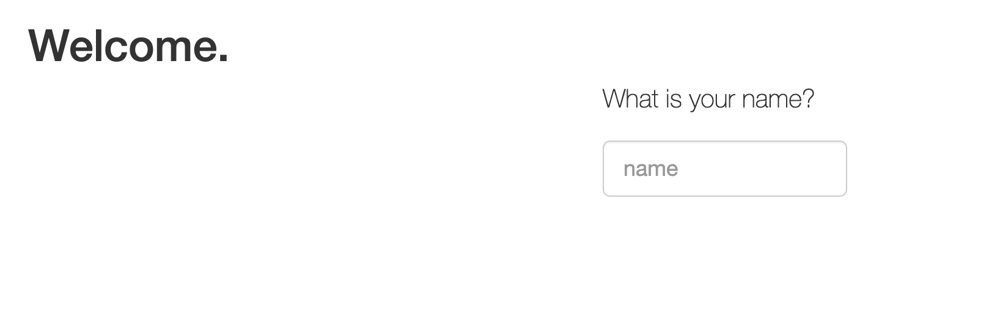
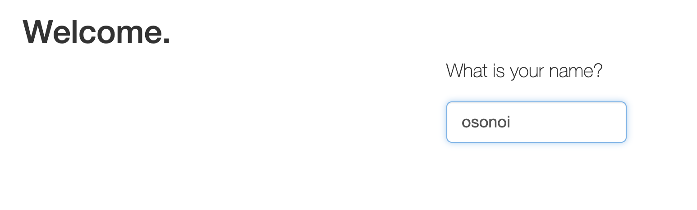
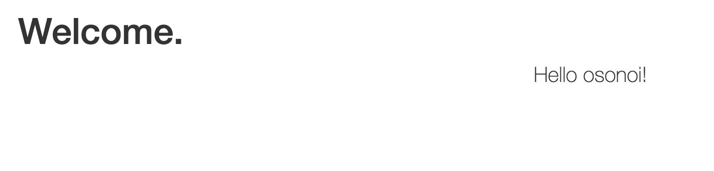

# IBM cloud CLIのインストール

[インストールはこちらから](https://cloud.ibm.com/docs/cli?topic=cli-install-ibmcloud-cli&locale=ja)

# IBM CF インストール
```
ibmcloud cf install
```
Git のインストール

```
Gitのインストール
Gitのバージンの確認
```

# IBM Cloud にログイン
 次のコマンドでibm cloudにログインしてください。
```
 ibmcloud login -r us-south
```
*参考　IBM Cloudのロケーション　https://cloud.ibm.com/docs/containers?topic=containers-regions-and-zones
# Cloud Foundryにアプリをデプロイ
　次のコマンドで実行環境Cloud Foundryをターゲットにします。
```
 ibmcloud target --cf
```
 gitでソースコードを自分のPCにクローンしましょう。(gitについてはGitの会で詳しく紹介します）

```
 git clone https://github.com/IBM-Cloud/node-helloworld.git
 cd node-helloworld/
```
現在他に動いているアプリがないか確認
```
 ibmcloud app list
```
あれば止める
```
 ibmcloud app stop アプリ名
```
IBM cloudのCloud foundryにソースコードをアップします。
```
 ibmcloud cf push
```
アプリのURLを確認：アプリ名の右の方にURLが出てきます。
```
 ibmcloud app list
```
ブラウザーでそのURLにアクセスして動作確認


名前をいれてEnter

結果表示


curl コマンドでも確認できます。
```
 curl アプリURL
```

その他のコマンド例
https://cloud.ibm.com/docs/cli?topic=cli-ibmcloud_commands_apps&locale=ja

 
