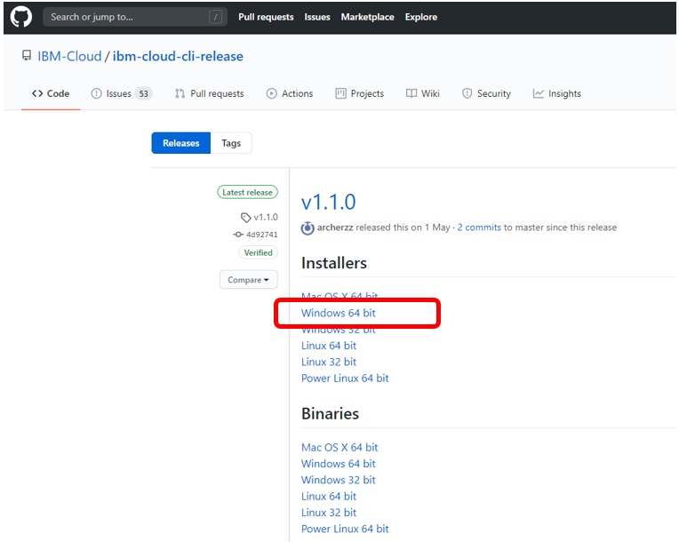
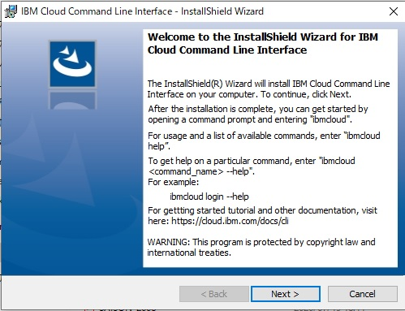
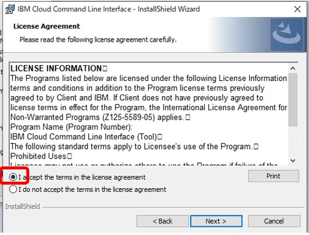
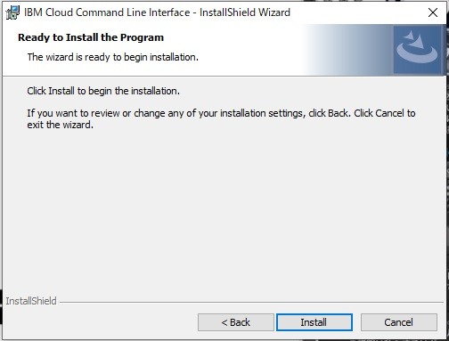
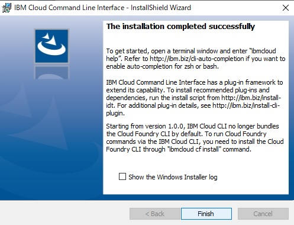
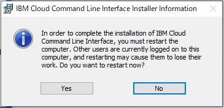
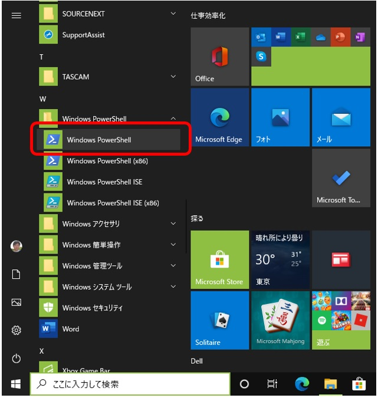

#WindowsにIBM Cloud CLIをインストール

- こちらからWindows 64 を選択インストーラーをダウンロードして実行してください。  
https://github.com/IBM-Cloud/ibm-cloud-cli-release/releases/
- (注意：インストーラーが終了するとシステムが再起動されます。作業途中のファイルなどがある場合は予め保存するなどしておいてください）
- こちらのファイルをダウンロード

- ダウンロードしたファイルをダブルクリックして実行

- "I accesp...."を選択

- ”Install"をクリック

- ”Finish"で終了

- 再起動しますか？ときいているので”Yes"をクリック　（＊＊作業中のファイルなどがあればほぞんしてください！）

- PowerShellを起動

- 次のコマンドを入れてインストールできたか確認してください。
```
ibmcloud -v
```
- 実行例

