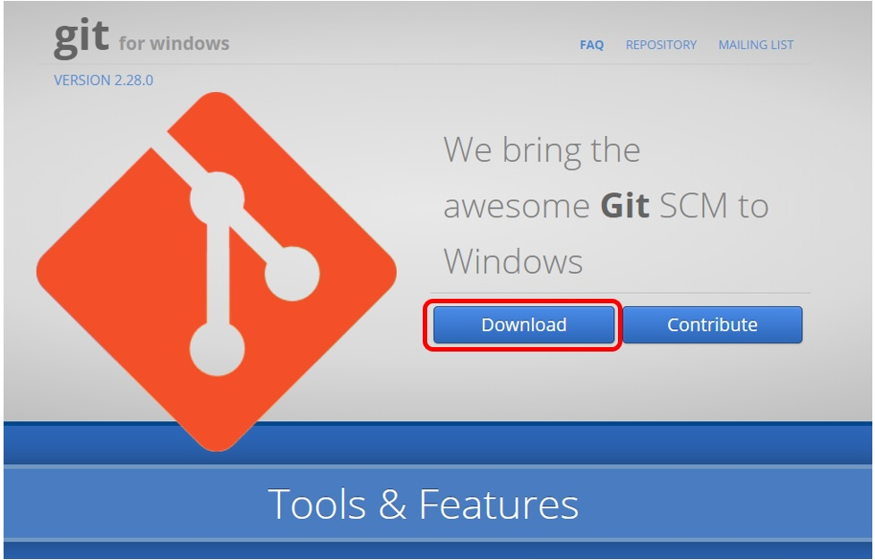
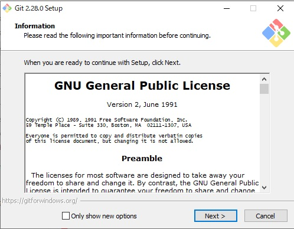
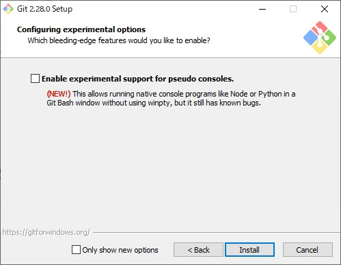
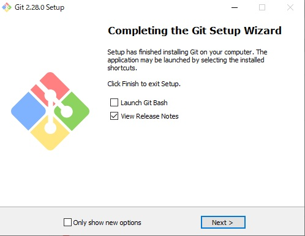
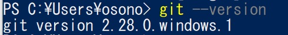

# Windows にgitをインストール

- こちらのサイトからgit for windowsをダウンロード、インストールしてください。
https://gitforwindows.org/
- こちらのファイルをダウンロード


- すべてデフォルトのまま”Next"をクリック


- ”install"をクリック


- ”Next"をクリック、インストール終了です。


- ”PowerShell”をたちあげてください。


- 次のコマンドでインストールを確認してください。
```
git --version
```
- 実行例


