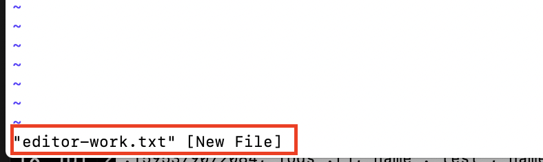
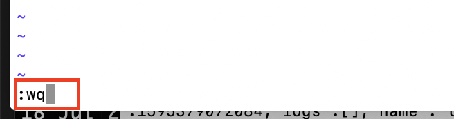
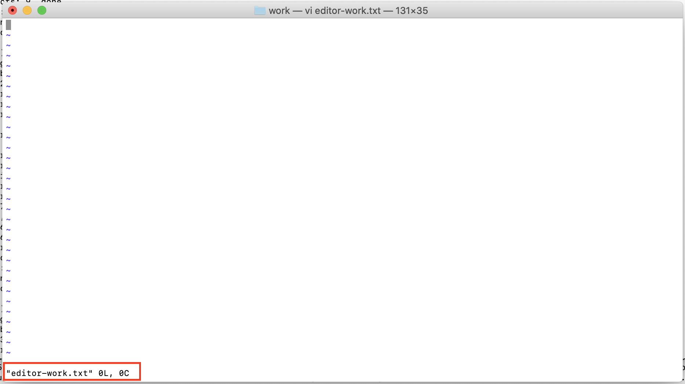
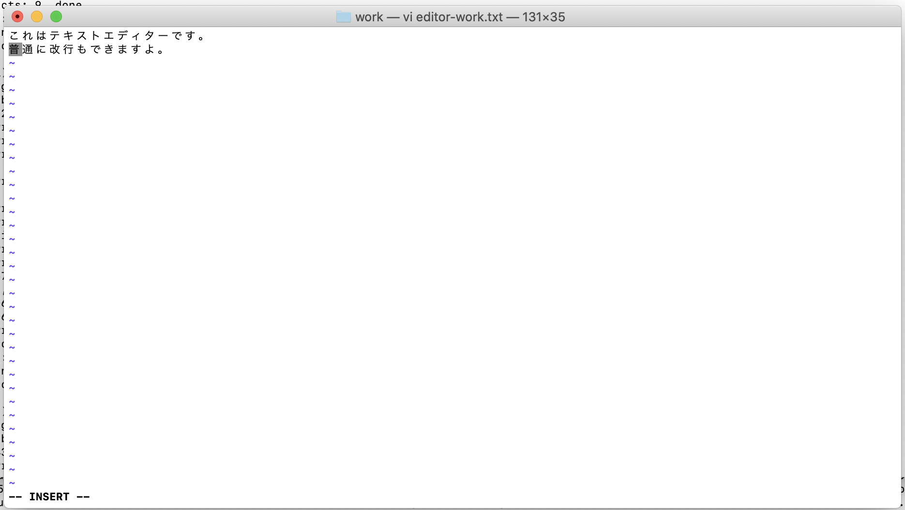
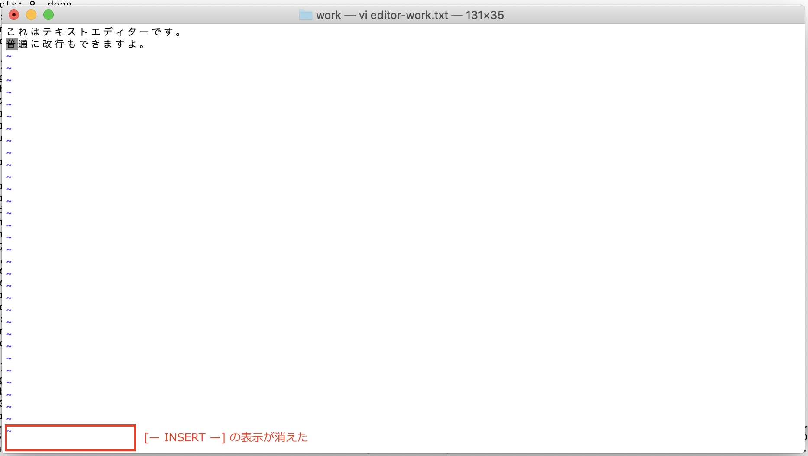
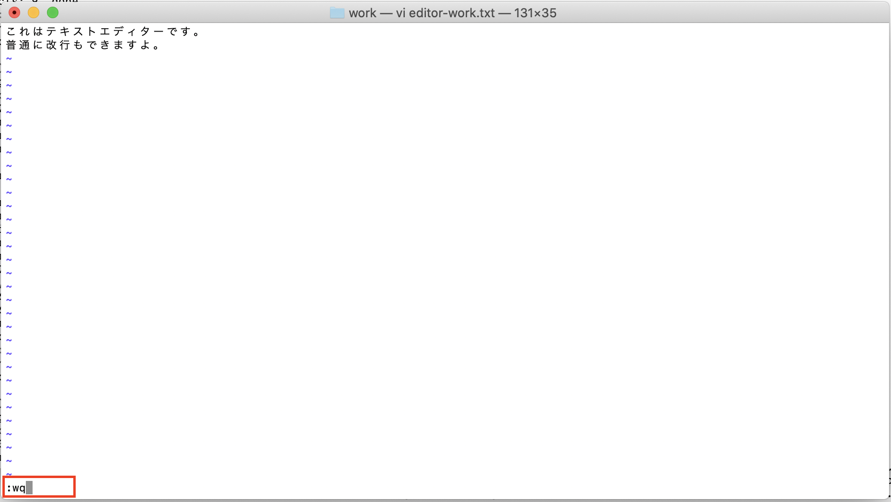
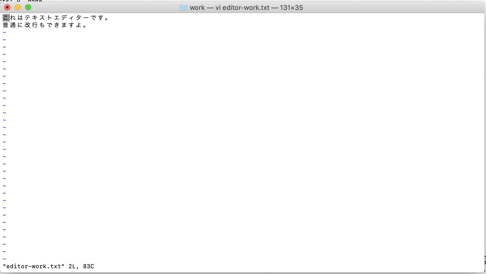

# vi入門
## 1. 本コンテンツの目的とゴール
本コンテンツでは、IBM Developer Dojoのようなクラウドを利用したインフラ構築やアプリケーションデプロイにおいて必要となるコマンド操作の延長として、コマンドラインから利用することのできるテキストエディターであるvi/Vim (* これらの説明は後述) について学ぶことを目的とする。

そのため、viやVimの応用操作などを含めたすべてを網羅するのではなく、一般的によく使われる（と筆者が感じる）操作をベースに、viの基本操作ができるようになるところをゴールとする。

## 2. viとは
viとは、主にUNIX環境で人気のあるテキストエディタ。

Visual EditorまたはVisual Interfaceからその名が付けられたと諸説ある。

viを開発したのは、BSDのBill Joy（William Nelson Joy）で、当初はPascalのソースコードに内包されていたが、後にBill本人により改良が加えられviとして世に認知されたと言われている。

現在よく知られているテキストエディターはスクリーンエディターと呼ばれるものであり、viはラインエディタの文化を受け継いでいるがゆえに操作アプローチが根本的に異なる。例えばWindows標準のメモ帳、Mac標準のテキストエディットなどの一般的なスクリーンエディターと比べるとわかりやすいが、以下が特徴的な点である。

1. マウスを使わない
2. モードという考え方がある
3. 命令ベースでの操作
4. CUI/CLIベースなので軽量

viの上位互換ツールとしてVimが存在する。MacやLinuxなどのUnix系OSには標準でVimがインストールされていることが多い。ここでは、Vimとviの詳細な違いについては解説しないが、Vimではviの機能はほとんど使うことができるので、viの操作を覚えるつもりで読み進めて頂けるとありがたい。

## 3. エディタのモード
さて、前述の通り、viの特徴の一つにモードという考え方がある。これは、テキストエディタを利用するにあたり、操作のカテゴリで**モード**を切り替えて使いましょう、という考え方である。

モードの利点としては、異なるモードでキー操作が独立するのでより細やかな操作を可能にする、というものがある。これは、同じく前述の特徴であるマウスを使わないコマンド入力ベースのインターフェースというところからの考え方だと思う。しかしながら、ここではあくまでvi入門ということで、基本的な操作に絞って解説をするため、あまり意識しなくて良いかもしれない。やりたい操作によって、モードを切り替える必要があるんだなぁ、くらいに覚えていただければと思う。

viではモードを主に以下の4つに分ける。ただし、厳密にはviでは編集モードとインサートモード（入力モード）の2つであり、4つに分けるのはVimとすることもある。現在、Macではviで起動した場合でも、以下4つのモードを使うことができるので、ここではこのように分類する。

|  モード  |  主な機能  |
| ---- | ---- |
|  ノーマルモード  |  カーソル移動、ヤンク（コピー）、プット（ペースト）、削除  |
|  インサートモード  |  文字入力  |
|  ビジュアルモード  |  範囲選択での編集（ヤンクや削除など）  |
|  コマンドモード  |  保存、終了、検索、置換  |

### 3-1. ノーマルモード
以下に、ノーマルモードで比較的良く使われるコマンドを記す。
ノーマルモードでは、基本的に既存の行や文字列に対しての操作を行うことが種である。

| キー入力 | 操作 | 
| ---- | ---- |
| [↑] or [k] or [Ctrl]+[p] | カーソル移動（上） |
| [↓] or [j] or [Ctrl]+[n] | カーソル移動（下） |
| [←] or [h] or [BackSpace] | カーソル移動（左） |
| [→] or [l] or [Space] | カーソル移動（右） |
| 数字[↑] or 数字[k] or 数字[Ctrl]+[p] | 指定文字数カーソル移動（上） |
| 数字[↓] or 数字[j] or 数字[Ctrl]+[n] | 指定文字数カーソル移動（下） |
| 数字[←] or 数字[h] or 数字[BackSpace] | 指定文字数カーソル移動（左） |
| 数字[→] or 数字[l] or 数字[Space] | 指定文字数カーソル移動（右） |
| yy | カーソル位置の現在行をヤンク |
| 行数[yy] | カーソル位置の現在行から指定行数分をヤンク |
| dd | カーソルの行を1行削除 |
| 数字[dd] | カーソルの行をn行削除 |
| D | 現在のカーソルから行末まで削除 |
| p | カーソルの後にプット |
| P | カーソルの前にプット |
| c | 削除して入力モードに移行 |
| C | 現在のカーソルから後ろをすべて削除して入力モードに移行 |
| w | 次の単語の先頭に移動 |
| W | 空白と改行で区切られた次の単語の先頭に移動 |
| e | 単語の末尾に移動 |
| E | 空白と改行で区切られた単語の最後尾に移動 |
| b | 前の単語移動 |
| B | 空白と改行で区切られた前の単語に移動 |
| ZZ | 保存してvimを終了する |

### 3-2. インサートモード
以下に、インサートモードで比較的良く使われるキー入力を記す。
インサートモードでは基本的に文字入力を行うことが主となるので、ベタ打ちでの入力でインサートモード、ヤンクなどの編集系コマンドはノーマルモード、といった感じでモードを切り替えながら編集すると良い。

| キー入力 | 操作 | 
| ---- | ---- |
| esc | ノーマルモードに移行 |
| Ctrl-c | ノーマルモードに移行3 |
| Ctrl-y | 上の行のカーソルの位置の文字を挿入 |
| Ctrl-e | 下の行のカーソルの位置の文字を挿入 |
| Ctrl-t | 1タブ入力 |
| Ctrl-d | 1タブ削除 |
| Ctrl-g j | 下の行に移動 |
| Ctrl-g k | 上の行に移動 |
| Ctrl-h | 1文字削除 |
| Ctrl-r {0-9a-z"%#*:=} | 指定したレジスタをプット |
| Ctrl-x Ctrl-n | 開いているファイルないにある単語補完 |

### 3-3. ビジュアルモード
ビジュアルモードは、テキストの部分を選択する柔軟で簡単な方法である。矩形(くけい)範囲のテキスト(ブロック)を選択する唯一の方法でもある。

| キー入力 | 操作 |
| ---- | ---- |
| - | 大/小文字の切替 |
| y | 選択した範囲をヤンク |
| d | 選択した範囲を削除 |
| c | 選択した範囲を削除して入力モードに移行 |
| > | 右シフト(選択した範囲を1タブ右に移動) |
| < | 左シフト(選択した範囲を1タグ右に移動) |
| I | 矩形選択の時、選択範囲のすべての行先頭にテキストを入力 |
| J | 選択した範囲をすべて連結する |
| o | 選択した範囲の先頭または末尾にカーソルを移動 |

### 3-4. コマンドモード
コマンドモードは、ノーマルモードの状態で：(コロン)をタイプすることでコマンド入力を受け付ける。そのため、移動系の操作はノーマルモードそのものである。

| キー入力 | 操作 |
| ---- | ---- |
| new | 新規バッファを作成 |
| tabnew | 新規タブを作成 |
| e | ファイルを編集 |
| r | 入力をバッファに挿入 |
| w | 現在のバッファを開いているファイルに書き込む |
| q | viを終了 |
| wq | バッファをファイルに書き込んでviを終了 |
| q! | viを強制終了 |
| %s/置換対象文字/置換する文字/g | 文字を置換する |
| reg | レジスタ一覧を表示 |
| his | コマンド履歴を表示 |

### 3-5. モード切り替え
以下のように、現在どのモードに居るかを確認の上、モードを切り替えます。

| 現在のモード | 移行先モード | キー |
| ---- | ---- | ---- |
| ノーマル | インサート | i、I、a、A、s、S |
| ノーマル | コマンド | : |
| ノーマル | ビジュアル | v、V、ctr-v |
| インサート | ノーマル | esc、ctrl-c |
| ビジュアル | ノーマル | esc、ctrl-c |
| コマンド | ノーマル | esc、ctrl-c |

## 4. 演習
ここからは、実際にファイルを作成、更新しながらviの操作を覚えていこうと思う。繰り返しになるが、本編ではIBM Developer Dojoなどのワークショップにおいて必要最低限と思われる部分をマスターすることを目的とするので、基礎的な内容であることはご容赦頂きたい。

### 4-1. 起動
1) ターミナルを起動
    Macであればアプリケーションからターミナルを選択し起動します。
    Windowsであれば、UNIXシェル(Bashやzsh)が動作するCUIツールを利用してください。
2) 任意の場所へ作業ディレクトリーを作成
    ディレクトリー名は、ここではworkとしていますが、お好きな名前で置き換えてください。
    ```bash
    $ mkdir work
    $ cd work
    ```

### 4-2. ファイル作成
1) コマンドラインでファイルの新規作成
    **editor-work.txt**という名前でファイルを作成します。以下の通りコマンドを実行してください。
    ```bash
    $ vi editor-work.txt
    ```

    左下に新規でファイルが作成される旨の表示が確認できます。
    

2) 何も編集せずにviを終了
    編集していないのですが、現状はオンメモリ（バッファ）に新規ファイルの情報が存在しているだけになります。コマンドモードで書き込み保存を行い、実ファイルとして保存します。
    vi上で、以下の通りコマンドを実行してください。
    ```vi
    :wq
    ```

    左下に打ち込んだコマンドが表示されればコマンドモードになっています。エディター上へ「:wq」という文字列としてタイプされているような表示になっていると、インサートモードになっている可能性がありますので注意してください。

    以下の画像のような感じに表示されていればOKです。
    

3) 作成したファイルの確認
    作成した（viコマンドモードで保存した）ファイルが作成されているか確認しましょう。以下のコマンドを実行してください。
    ```bash
    $ ls -l
    -rw-r--r--   1 taiji  staff    0 Jul 27 18:39 editor-work.txt
    ```

    無事、指定したファイル名でファイルが作成されていれば成功です。

### 4-3. ファイル指定
1) viコマンドから特定のファイルを指定して開く
    前の手順で作成した**editor-work.txt**を開きます。以下のコマンドを実行してください。
    ```bash
    $ vi editor-work.txt
    ```

    ４−２の1)と同じコマンドです。異なるのは、先程は未だ存在しないファイル名を指定しており、今回は既存のファイルを指定している、というところです。

    つまり、同じ```vi ファイル名```を実行した場合、存在しないファイル名であれば新規作成としてviエディターが開き、既存のファイル名であればそのファイルを編集する形でviエディターが開く、ということです。

### 4-4. 編集
1) ファイルの中身を編集
    一つ前の手順で、**editor-work.txt**を開いたので、このテキストファイルが編集できる状態でviエディタが開いています。ここでは、開いたファイルの中身が空である事が確認できればOKです。

    

2) 文字列の書き込み
    インサートモードにして文字列を書き込んでいきましょう。キーの ```i``` を1回タイプしてください。タイプするとインサートモードに入ります。エディタの左下へ[-- INSERT --]という文言が表示されていればインサートモードになっています。

    

    何を書き込んでも良いのですが、何か決めたほうがみなさん進めやすいと思うので、以下の文章を書いてみましょう。
    ```vi
    これはテキストエディターです。
    ```

    改行も入れて行きましょうね。通常のメモ帳アプリなんかと同じで、普通にEnterキーを入力すれば改行されます。
    ```vi
    これはテキストエディターです。
    普通に改行もできますよ。
    ```

    

    ここまで入力したら、インサートモードを終了しノーマルモードへ戻りましょう。インサートモードで ```Esc``` キーを1回タイプしてください。タイプするとエディタの左下の[-- INSERT --]という文言が消え、ノーマルモードへ戻ります。

    


### 4-5. 保存
1) 編集した内容を保存して閉じる
    これまで入力した内容を保存していきましょう。今度はコマンドモードへ入りましょう。現在はノーマルモードに居ますので、この状態で ```:``` (コロン)を1回タイプしてください

    コロンをタイプすると左下へコマンドを入力できるようになるので、ここで以下の通りコマンドを入れてEnterで実行します。
    ```vi
    wq
    ```

    

2) 保存したファイルの確認
    コマンドが実行されると、通常のシェルの画面へ戻ります。以下の通りコマンドを実行してファイルのタイムスタンプが更新されていることを確認します。
    ```bash
    $ ls -l
    -rw-r--r--   1 taiji  staff   83 Jul 27 20:52 editor-work.txt
    ```

    さらに、再度 ```vi``` コマンドを実行してファイルの中身が更新されていることを確認します。
    ```bash
    $ vi editor-work.txt
    ```

    

### 4-6. 破棄
編集した内容を破棄して閉じる
### 4-7. 検索・置換
特定の文字列を検索する、置換する
### 4-8. コピー・ペースト
行コピー、文字コピー、その他
### 4-9. Undo、Redo
直前の操作の取り消し、取り消しの取り消し
### 4-10. その他
ウィンドウ操作、行番号表示、インデント、など

## 5. まとめ