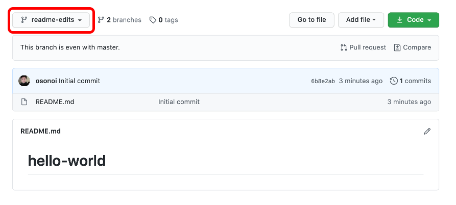
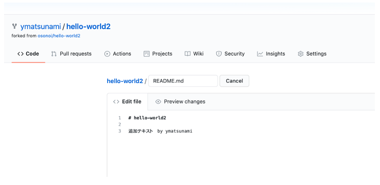
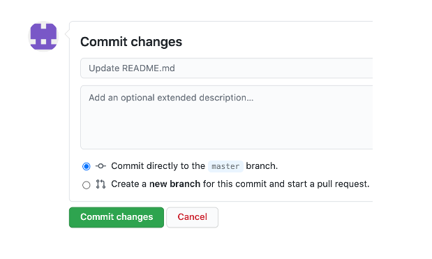
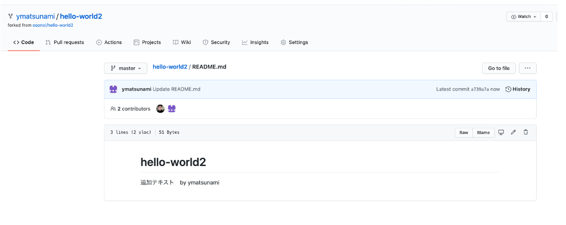
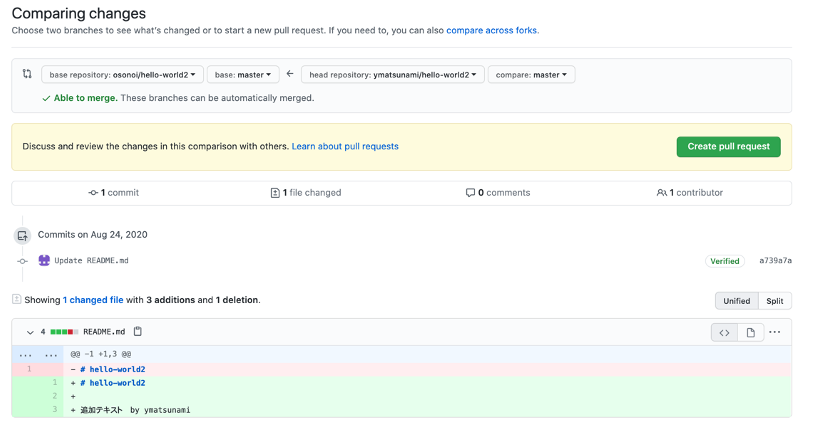

# Dojo Basic: Lab3-1 GitHub基礎

## 目的とゴール
### 目的
 - GitHubを使ったソフトウェア管理を体験します。

### ゴール
 - GitHubでソースコードの管理、共同作業を行える様にする。

### このLabの実施前提
 - GitHubのアカウントを持っていること
 
### このLabで体験できること
 - GitHubでレポジトリー(Repository), README.mdを作成
 - ブランチ(Branch)を作成、README.mdを編集
 - コミット(Commit), プルリクエスト(pull Request)を行う
 - 他の人のrepository からfork
 - コードを修正、Pull Requestを行う
 参照　https://guides.github.com/activities/hello-world/?fbclid=IwAR2fRgqDpfDh5vUCeYrP_HbNZhT6MoVnFqgRztJoJD0u3QSmSzOC7ieqiRI

# GitHubとは
GitHubは、バージョン管理とコラボレーションのためのコードホスティングプラットフォームです。GitHub を使えば、どこにいてもプロジェクトで他の開発者と一緒に作業することができます。

このチュートリアルでは、リポジトリ、ブランチ、コミット、プルリクエストといった GitHub の基本的なことを学びます。Hello World リポジトリを作成し、GitHub の Pull Request ワークフローを学びます。

このチュートリアルを完成させるには、GitHub.com のアカウントとインターネットへのアクセスが必要です。コードの書き方やコマンドラインの使い方、Git (GitHub の上に構築されたバージョン管理ソフトウェア) のインストールなどの知識は必要ありません。

# Step 1. Repository(リポジトリー)を作成する
リポジトリは通常、一つのプロジェクトを整理するために使用されます。リポジトリには、フォルダやファイル、画像、ビデオ、スプレッドシート、データセットなど、プロジェクトに必要なものは何でも入れられます。最初にプロジェクトに関する情報をまとめたファイル、READMEを用意することをお勧めします。また、ライセンス情報なども入れておくといいでしょう。

これから最初のレポジトリ　”hello-world”を作っていきましょう。

## 新しいリポジトリを作成するには
- GitHubページ(https://github.com/)にログインしてください。画面の左上にご自分の名前、"Repositories"の右側の"New"をクリックしてください。

<kbd></kbd>

- ① リポジトリの名前を hello-world とします。
- ② このリポジトリを README で初期化するを選択します。
- ③ "Create Repository"をクリックしてください。

<kbd></kbd>

#  Step 2. ブランチを作る
ブランチとは、リポジトリの異なるバージョンの作業を行う方法です。

デフォルトでは、リポジトリには mainという名前のブランチがあります。meinブランチにコミット(書き込み）する前にデバッグ、テストをしたり、編集をしたりするためにブランチを使います。

mainブランチからブランチを作成するときは、その時点での mainのコピー、つまりスナップショットを作成することになります。あなたがブランチで作業をしている間に誰かがメインブランチに変更を加えた場合でも、その更新を取り込むことができます。

この図を見てください。

- メインブランチ
- readme-edits という名前の新しいブランチ
- 修正をmainに統合するまでの流れ

<kbd></kbd>

共同作業でファイルの異なるバージョンを保存したことがありますか？　例えると以下のようにファイル名を変えて管理していくような感じです。

- story.txt
- ストーリージョー編集.txt
- ストーリージョウ編集部レビュー済みtxt
ブランチは、GitHub のリポジトリでも同じような目的を達成することができます。

ここGitHubでは、開発者、ライター、デザイナーがブランチを使ってバグ修正や機能追加の作業をメインブランチとは別に行っています。変更の準備ができたら、ブランチをメインブランチにマージします。

## 新しいブランチを作る
リストの左上にある branch: main というドロップダウンをクリックします。
①　新しいブランチのテキストボックスにブランチ名を readme-edits と入力します。
②　Create branch readme-editsをクリックしてください。

<kbd></kbd>

ブランチが"readme-edits"に変わったのがわかります。README>mdの内容は変わりません。
<kbd></kbd>

これでmainとreadme-editsの2つのブランチができました。見た目は全く同じですが、次に新しいブランチに変更点を追加します。

# Step 3. 変更してコミットしましょう
では、編集をしてみましょう。

GitHub では、編集して保存することをコミットと呼びます。それぞれのコミットにはコミットメッセージが付きます。コミットメッセージには変更の履歴が記録されているので、他の投稿者はあなたが何をしたのか、なぜ変更したのかを理解することができます。

変更の作成とコミット
- 1 ファイルビューの右上にある鉛筆のアイコンをクリックして編集します。
<kbd>

- 2 何か文章を追加してみてください。
<kbd></kbd>

- 4 追加した内容にコメントを書いておきましょう。
<kbd></kbd>

- 5.変更をコミットするボタンをクリックします。

<kbd></kbd>

これらの変更は readme-edits ブランチの readme ファイルだけに行われるので、このブランチには main とは異なる内容が含まれます。

# Step 4. プルリクエストする
もう少し頑張りましょう。 main 以外のブランチに変更を加えたので、プルリクエストを開いてみましょう。

プルリクエストは、GitHub での共同作業の中心となるものです。プルリクエストを開くと、あなたの変更点を提案し、誰かがあなたの投稿を確認してプルインして自分のブランチにマージすることを要求していることになります。プルリクエストには、両方のブランチの内容の差分が表示されます。変更、追加、削除は緑と赤で表示されます。

コミットしたらすぐにプルリクエストを開いて、コードが完成する前から議論を始めることができます。

GitHub の @mention システムをプルリクエストのメッセージに使えば、特定の人やチームにフィードバックを求めることができます。

①pull requestを選択、　②　"Create a pull request"をクリックしてください。

<kbd></kbd>

今回のプルリクエストに関するコメントを書いてください。
<kbd></kbd>
"Create a pull request"でmainブランチへの変更依頼(pull request)を遅れます。

# Step 5. プルリクエストを取り込む（マージする）
この最後のステップでは、あなたの変更をまとめる時が来ました - readme-edits ブランチをメインブランチにマージします。

- mainブランチを選択してください
<kbd></kbd>
- "Pull requests"を選択してください。先ほどのプルリクエスト"Update README.md"をクリックしてください。
<kbd></kbd>
- 問題なければ"Merge pull request"をクリックしてください
<kbd></kbd>
- "Confirm merge"をクリックしてください
<kbd></kbd>
- readme.editsでの変更が反映されましたね。
<kbd></kbd>

お疲れ様でした!
このチュートリアルが完了したことで、プロジェクトを作成して GitHub でプルリクエストを行う方法を学びました。

このチュートリアルで達成したことは次のとおりです。

のリポジトリを作成する
新規支店の立ち上げと運営
ファイルを変更し、その変更を GitHub にコミットしました。
プルリクエストのオープンとマージ
あなたのGitHubプロフィールを見てみましょう。

Pull Requests の力について詳しく知りたい場合は、GitHub のフローガイドを読むことをお勧めします。また、GitHub Explore にアクセスしてオープンソースプロジェクトに参加してみるのもいいかもしれません。

GitHubは、バージョン管理とコラボレーションのためのコードホスティングプラットフォームです。GitHub を使えば、どこにいてもプロジェクトで他の開発者と一緒に作業することができます。を
GitHubは、バージョン管理とコラボレーションのためのコードホスティングプラットフォームです。GitHub を使えば、どこにいてもプロジェクトで他の開発者と一緒に作業することができます。

# プルリクエストその２
　上記の例では自分が作ったリポジトリーあるいはリポジトリーの編集権限がある場合の例です。ここではその権限がない場合、他の人のレポジトリーにプルリクエストする場合の手順をご紹介します。
この時に使われるのが”フォーク(fork)”と呼ばれる機能です。
GitHubにサインインした後にへターゲットのレポジトリーをに行ってください。　（ここでは例としてhttps://github.com/osonoi/hello-world2)　"osonoi"と言うアカウントの"Hello-world"をフォークします。

右上にある"Fork"をクリックしてください。
<kbd></kbd>
フォークしたい自分のアカウントを選択します。(この場合はosonoi-hotと言うアカウントでログインしています）
<kbd>v</kbd>
先ほどのレポジトリーが自分のレポジトリーとして編集できるようになりました。右側のペンのアイコンをクリックして編集しましょう
<kbd></kbd>
新しいテキストを入力します。
<kbd></kbd>
変更をコミットします。
<kbd></kbd>
変更が反映されましたね。ご自分（ここでは(osonoi-hot)のレポジトリーの内容が変更されました。
<kbd></kbd>
"Pull-request"をしてみましょう。上のメニューから"Pull-requests"を選んで
<kbd></kbd>
"Create pull resuest"をクリック
<kbd></kbd>
コメント追加して"Pull request"をクリック
<kbd></kbd>
