# Git入門
## 1. 本コンテンツの目的とゴール
本コンテンツでは、IBM Developer Dojoのようなクラウドを利用したインフラ構築やアプリケーションデプロイにおいて必要となるコマンド操作の延長として、バージョン管理ツールの一つであるGitについて学ぶことを目的とします。

Gitのいろいろな機能の中から、一般的によく使われる（と筆者が感じる）操作をベースに、Gitの基本操作ができるようになるところをゴールとします。

## 2. Gitとは
では最初に確認したいと思いますが、[Git(ギット)](http://git-scm.com/)とはなんでしょうか？Gitは、いわゆる変更履歴管理・バージョン管理ツールの一つであると言えます。では、この手のツールとしてよく知られているCVSやSVNなどとは何が違うのでしょうか？

Gitも同じく、プログラムソースなどの変更履歴を管理するバージョン管理ツールなのですが、一般的に「分散型」と呼ばれるタイプになります。もともとはLinuxの開発チームが使用していたものが、世界中の技術者に広まったようです。

Gitの特徴としては、分散型と呼ばれるように、自分の端末などのローカル環境に、完全なリポジトリの複製が作成されるところかと思います。これには、今までの変更履歴がすべて含まれます。前述のCVSやSVNなどに代表される集中管理型のバージョン管理システムでは、サーバー上にある１つのリポジトリに利用者全員がアクセスします。Gitでは、基本的にはローカルへ複製したリポジトリにアクセスして作業を行います。また、Gitではローカル環境にもコードの変更履歴を保存（コミット）することができるので、リモートのサーバーに常に接続する必要がありません。このため、ネットワークに接続していなくても作業を行うことができます。

Gitのイメージは以下の通りです。
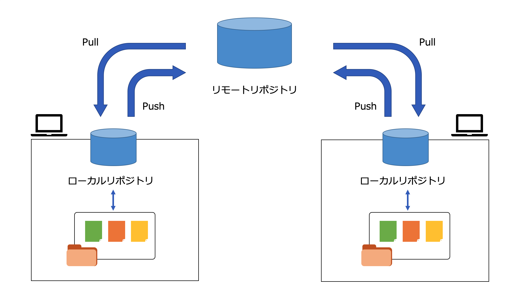

## 3. GitとGitHub
さて、みなさんはGitとは別にGitHubというのも聞いたことあるのではないでしょうか？<br>
[GitHub(ギットハブ)](https://github.co.jp/)とは、前述のGitの仕組みを利用して、ソースコードなどのリソースを保存、公開することができるようにしたウェブサービスです。そうです、まさに今みなさんが見ているこのページは、GitHub上のリポジトリへ置かれた（公開された）README.mdというマークダウンファイルになります。

本Labでは、Git編とは別に[Lab3-1 GitHub基礎](https://github.com/IBMDeveloperTokyo/DojoBasicLab/tree/master/Lab3_GitHub/Lab3-1_GitHub)も用意していますので、必要に応じてそちらもご参照ください。

## 4. 演習
演習に入るにあたり、前述のリモートとローカルについて補足します。Gitコマンドでは、特に指定しない限りリポジトリはローカルへ作成されます。そのリポジトリを公開するための一つの方法が、GitHubというWebサービスです。　<br>
ローカルで作成したリポジトリに対応するリポジトリは、リモート側にも存在する必要があります。最初にGitHubへ作成したリポジトリをローカルへ複製するか、ローカルで作成したリポジトリをリモートへ反映させるか、のどちらかになります。<br>
今回はリモート側のリポジトリとして先にGitHubへリポジトリを作成し、それをローカルへ複製するという方法で演習を進めていきたいと思います。

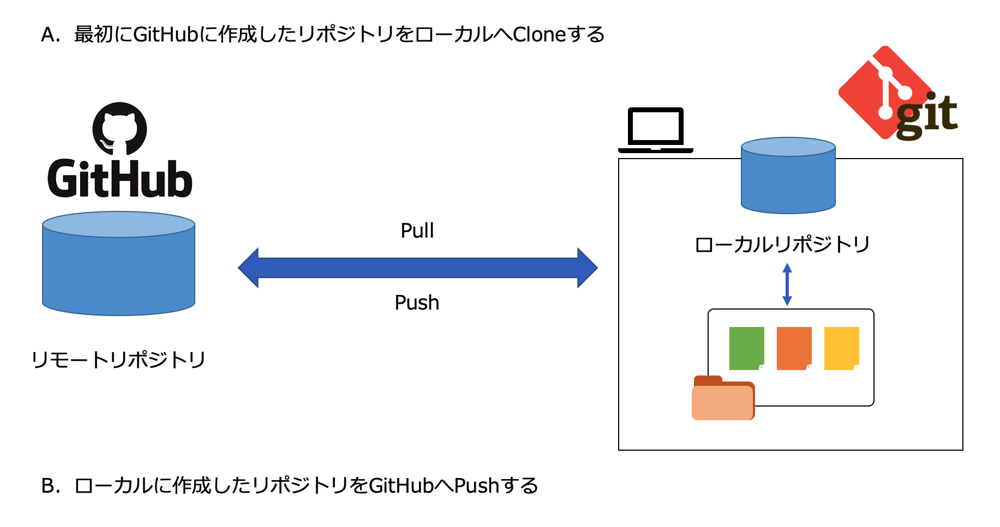

今回は行いませんが、コマンドでリポジトリを作成し初期化する方法は以下の通りです。

### ローカルリポジトリの作成
```
$ mkdir <リポジトリへ指定したいディレクトリ名>
$ cd <mkdirで作成したディレクトリ>
$ git init
```

### リモートリポジトリの作成
```
$ mkdir <リポジトリへ指定したいディレクトリ名>
$ cd <mkdirで作成したディレクトリ>
git init --bare --share
```

コマンドを実行すると、対象のディレクトリがGitリポジトリとして管理されるための **.git** ディレクトリが作成されます。

では、GitHubを使いながら演習を進めていきましょう。

### 4-1. GitHubアカウント登録
本演習では、GitHubでの操作を交えながらGitの操作を学んでいきます。まずはGitHubのアカウントを作成しましょう。すでにアカウントをお持ちの方はそちらをお使いください。

下記サイトへアクセスします。<br>
https://github.com/

案内に従いアカウントを作成します。
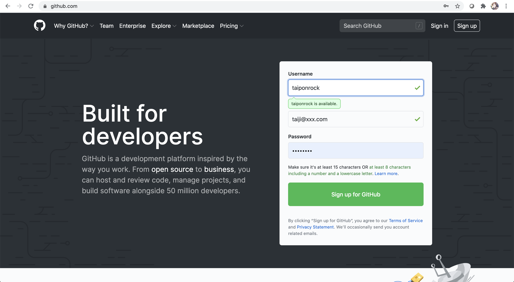

アカウントが作成できたらGitHubへログインします。
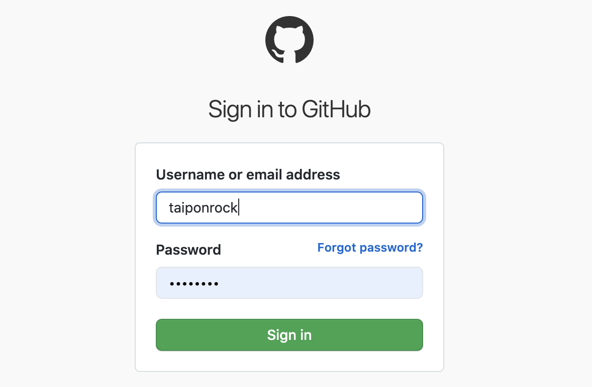

### 4-2. GitHubリポジトリ作成
GitHubへログインしたら右上の＋ボタンから「New repository」を選択します。
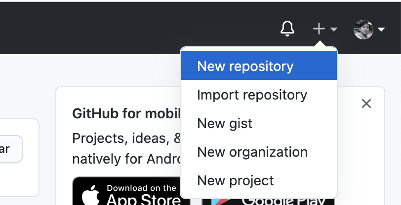

ここでは、以下のように設定します。

```
Repository name: DojoLab
Description: DojoLab練習用リポジトリです
公開範囲: Public
Initialize this repository with a README: チェックON
```
設定したら「Create repository」をクリックしてリポジトリを作成します。
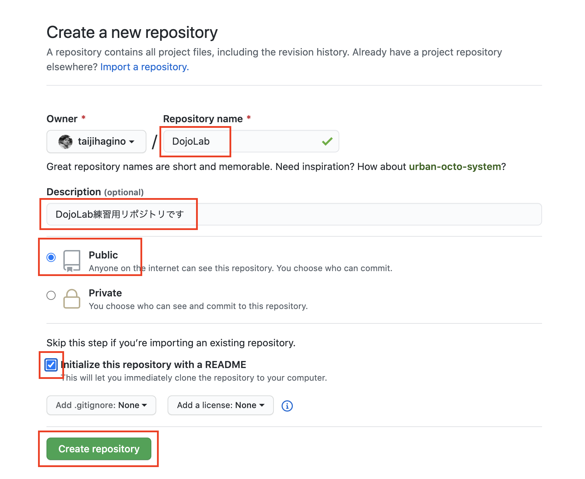

以下のように画面が表示されればリポジトリの作成は成功です。
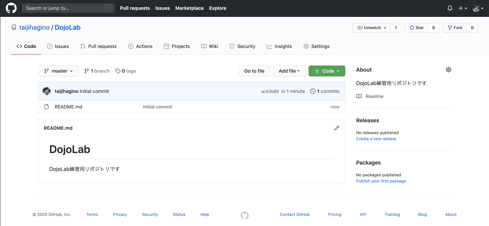

### 4-3. Gitのインストール
次に、コマンドラインで作業をする端末にGitのコマンドラインツールをインストールします。これは、使用するOSによってインストール方法が異なります。

**Linux**

yumコマンドを使用してインストールします。下記のコマンドを実行してください。

```
$ sudo yum install git-all
```

**Mac**

インストーラーを使用してインストールします。インストーラーは、[Git公式サイト](http://git-scm.com/download/mac)からダウンロードできます。

**Windows**

インストーラーを使用してインストールします。インストーラーは、[Git公式サイト](http://git-scm.com/download/win)からダウンロードできます。


詳細は[Git公式サイトの手順](https://git-scm.com/book/ja/v2/%E4%BD%BF%E3%81%84%E5%A7%8B%E3%82%81%E3%82%8B-Git%E3%81%AE%E3%82%A4%E3%83%B3%E3%82%B9%E3%83%88%E3%83%BC%E3%83%AB)を参考にしてください。


### 4-4. Git初期設定
Gitがインストールできたら、ターミナルからバージョンを確認してみましょう。バージョンが表示されればインストールは成功です。以下のコマンドを実行してください。

```
git --version
```

次に、GitHubで作成したリポジトリへアクセスするために使用するGitHubのユーザー名とメールアドレスを設定ファイルへ登録しておきます。
以下のコマンドを実行してください。その際 **--global** オプションをつけるとマシン全体に適用されます。省略または、**--local** オプションをつけるとそのリポジトリのみに適用されます。

```
$ git config user.name <id>
$ git config user.email <mail>
```
例）
```
$ git config user.name taijihagino
$ git config user.email taiji@xxx.com
```

### 4-5. リポジトリの複製
では、先程作成したリポジトリを複製しましょう。これは、前出のイメージのローカルリポジトリを作成する行為になります。

作業用ディレクトリに移動します。必要に応じディレクトリを作成してください。
```
$ cd /Users/taiji/work/
```

リポジトリをクローンします。<br>
```
$ git clone <リポジトリURL>
```
例）
```
$ git clone https://github.com/taijihagino/DojoLab.git
```

クローンすると、対象のリポジトリ配下のファイルがまるっと一式ローカルへコピーされますので、コピーされた（クローンされた）ディレクトリへ移動してください。<br>
```
$ cd <リポジトリ名のディレクトリ>
```
例）
```
$ cd DojoLab.git
```

### 4-6. 作業用ブランチの作成とチェックアウト
Gitの考え方として、リポジトリの正となる領域をmaster(マスター)と呼び、作業(ファイル編集や追加など)を行う際にはbranh(ブランチ)と呼ばれる領域を一時的に作成し、そこで作業を行います。作業した内容、つまり編集内容はこのbranchへ一旦コミットされるわけです。その後、branchの内容をmasterへ反映する、という流れになります。

では、ここでもさっそく作業用のbranchを作成しましょう。まずは今いるbranchがmasterであることを確認します。引数を指定せずにbranchコマンドを実行すると、ブランチの一覧を表示することができます。頭に * のついているのが現在のブランチです。以下のコマンドを実行してください。

```
$ git branch
* master
```

masterが表示されていればOKです。<br>
では、次に作業用のブランチを作成します。新たにブランチを作成してから、masterから作成したブランチへ切り替えることもできますし、一気にブランチ作成と切り替えを行うこともできます。<br>
ブランチの切り替えというのは「どのブランチとしてソースをチェックアウトするか」ということです。ではやってみましょう。

#### 4-6-1. branchを作成

以下のコマンドを実行してください。

```
$ git branch <branchname>
```
例）
```
$ git branch work
```

では、確認してみましょう。再度branchコマンドを実行してください。
```
$ git branch
* master
  work
```

workというブランチが作成されていることが確認できたと思います。

#### 4-6-2. ブランチの切り替え
新しく作成したworkブランチで作業を行うためには、workブランチをチェックアウトする必要があります。ブランチのチェックアウトはcheckoutコマンドで行います。以下のコマンドを実行してください。

```
$ git checkout <branch>
```

例）
```
$ git checkout work
Switched to branch 'work'
```

これで、ブランチがmasterからworkへ切り替わりました。

ブランチを作成すると同時にチェックアウトまで行うには以下のコマンドを実行してください。
```
$ git checkout -b <branch>
```
例）
```
$ git checkout -b work
Switched to a new branch 'work'
```

これで作業する準備ができました。次はファイルを編集していきましょう。

### 4-7. ファイルの追加・編集
前の手順でローカルへCloneしたファイル群の中に **README.md** がありますので、これを編集しましょう。

適当なエディタでREADME.mdを開きます。
cloneしたままの状態だと以下のような文言が記述されています。
```
# DojoLab
DojoLab練習用リポジトリです
```

ここに、なんでも良いので一文追加しましょう。ここでは、最終行に以下のように追記しました。
```
# DojoLab
DojoLab練習用リポジトリです
Git練習用に一文追加しました！
```

追記したらファイルを保存して閉じておいてください。<br>
そうしましたら、今いるブランチがどのような状態なのか(どのような作業が行われた状態なのか)を確認しましょう。以下のコマンドを実行してください。
```
$ git status
On branch work
Changes not staged for commit:
  (use "git add <file>..." to update what will be committed)
  (use "git restore <file>..." to discard changes in working directory)
	modified:   README.md

no changes added to commit (use "git add" and/or "git commit -a")
```

README.mdが変更されたと表示されていますが、コミット向けに変更内容が追加されていないとも表示されています。<br>
Gitでは、ファイルを変更、削除、追加などした場合、一足飛びにリポジトリへコミットすることはできません。コミットの前に変更したファイルをコミット対象にすると明示的に追加する必要があります。<br>
以下のコマンドを実行することでコミット対象のファイルを追加できます。
```
$ git add <コミット対象のファイル名>
```

ファイル名は明示的にファイルを指定することもできますし、変更した全てのファイルを指定することもできます。全てのファイルを指定したい場合はファイル名の部分に「.」を指定してください。<br>
ここでは、全てのファイルを指定する形で実行します。(実際にはREADME.md一つのみですが)<br>
以下のように実行してください。
```
$ git add .
```

特にレスポンスはありませんが、これで変更したファイルがコミット対象となりました。再度statusコマンドで確認してみましょう。
```
$ git status
On branch work
Changes to be committed:
  (use "git restore --staged <file>..." to unstage)
	modified:   README.md
```

コミット対象にREADME.mdが追加されましたね。

### 4-8. 変更のコミット
コミットへの準備ができたので、実際にコミットしていきましょう。<br>
コミットはcommitコマンドを使いますが、コミットコメントが必須パラメーターになります。以下のようにコマンドを実行してください。

```
$ git commit -m"README.mdを更新"
[work 3eefb35] README.mdを更新
 1 file changed, 1 insertion(+)
```

そうです、-mがコメントのパラメーターになります。もし、このパラメーターを付けずにcommitコマンドを実行すると、viが開きコメントの入力を求められます。その場合はそこでコメントを記載すればOKです。

これでコミットはOKです。

### 4-9. 変更のマージ
ブランチのマージはmergeコマンドを使います。

ここでは、masterブランチにworkの変更を取り込むということをします。
まずはmasterブランチに移動しましょう。

```
$ git checkout master
Switched to branch 'master'
Your branch is up to date with 'origin/master'.
```

マージを行う前に、一旦README.mdファイルの中身を確認してみます。
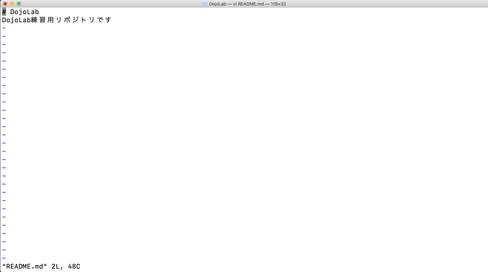

先程のファイルの編集はworkブランチ上で行ったので、masterブランチのREADME.mdの内容は変更されていません。

```
$ git merge work
Updating ac63b89..3eefb35
Fast-forward
 README.md | 1 +
 1 file changed, 1 insertion(+)
```

マージが成功しました。再度README.mdを開いて内容を確認してみましょう。

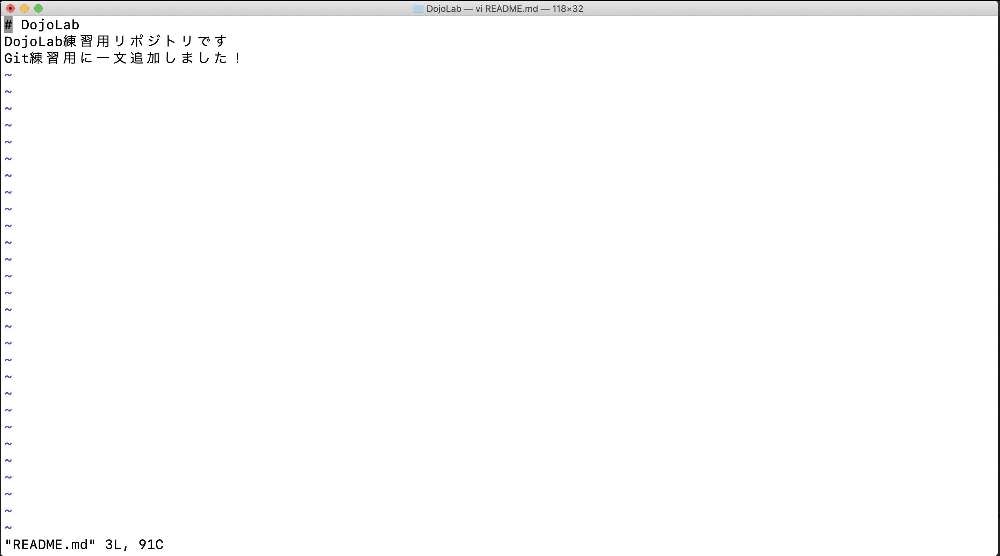

ローカルリポジトリ上でのマージはこれでOKです。

### 4-10. 変更の送信
次に、リモートリポジトリへの送信を考えます。<br>
最初に作成したGitHubのリポジトリを見てみましょう。README.mdの内容は変更されていません。なぜなら、今までやってきた作業はすべてローカルリポジトリ上でのものだったからです。

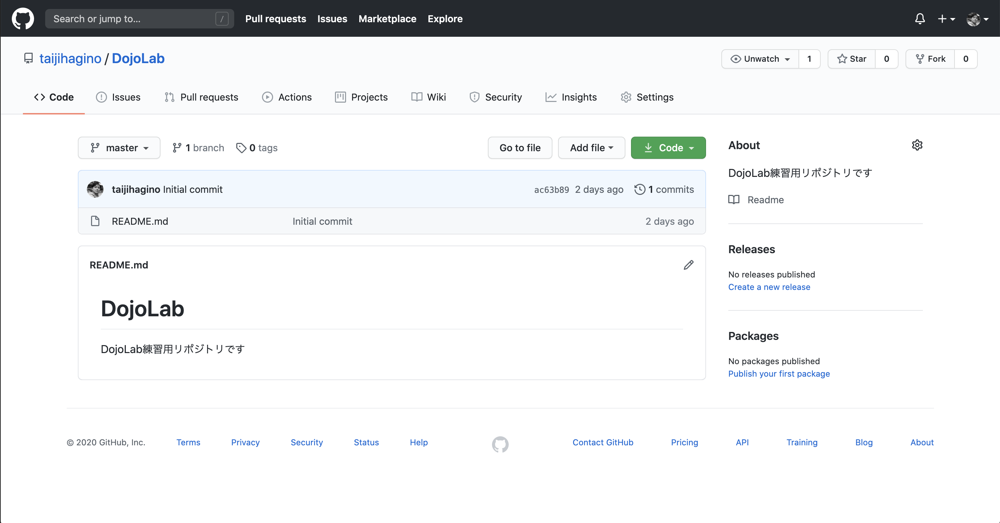

では、この変更内容をGitHubのリポジトリ(clone元、つまりリモート)へ反映させていきましょう。変更を送信するため、以下のコマンドを実行してください。

```
$ git push origin master
Enumerating objects: 5, done.
Counting objects: 100% (5/5), done.
Delta compression using up to 4 threads
Compressing objects: 100% (2/2), done.
Writing objects: 100% (3/3), 352 bytes | 352.00 KiB/s, done.
Total 3 (delta 0), reused 0 (delta 0)
To https://github.com/taijihagino/DojoLab.git
   ac63b89..3eefb35  master -> master

```

今回は自分がオーナーのリポジトリに対して、masterからmasterへpushを行ったので、そのままダイレクトに変更が反映されました。<br>
再度GitHubへアクセスして確認してみましょう。

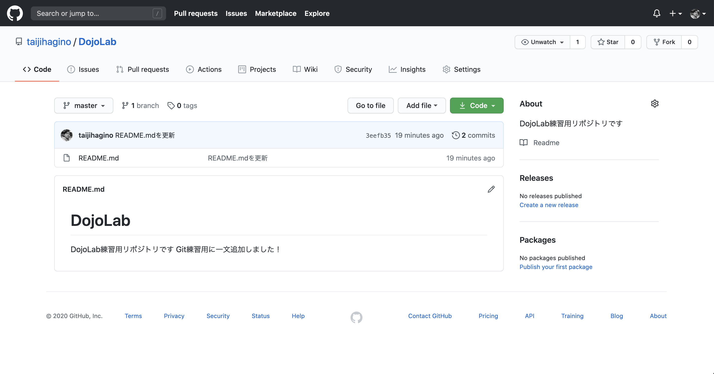

変更が反映されたことが確認できました。

### 4-11. 変更の変更反映依頼
さて、わかりやすくするために、今はローカルのmasterからリモートのmasterへ直接pushして反映を確認しました。<br>
しかし、通常よくあるケースは以下のパターンだと思います。

* リポジトリオーナーが自分ではない
* リポジトリオーナーに自分も含まれているがチームで所有しているので反映の最終確認を他者が行う

これを体験してみましょう。再度workブランチをチェックアウトします。

```
$ git checkout work
Switched to branch 'work'
```

ファイルを編集します。更にもう一文追加しましょう。以下のように追記して保存してください。

```
# DojoLab
DojoLab練習用リポジトリです<br>
Git練習用に一文追加しました！<br>
さっきは改行いれてなかったねー
```

ファイルを保存したら、同じ手順で**add**して**commit**してください。
```
$ git add .
```

```
$ git commit -m "README.mdを更新"
[work ee246cf] README.mdを更新
 1 file changed, 3 insertions(+), 2 deletions(-)
```

さて、ここで先程はmasterをチェックアウトしてマージを行いました。そして、masterからpushしたわけですね。<br>
ここでは、わかりやすいように、このworkブランチからリモートへpushしていきましょう。つまり、ローカルリポジトリのブランチであるworkの変更がリモートのGitHubリポジトリへ送信されるというわけです。<br>
以下の通りコマンドを実行してください。

```
$ git push origin work
Enumerating objects: 5, done.
Counting objects: 100% (5/5), done.
Delta compression using up to 4 threads
Compressing objects: 100% (2/2), done.
Writing objects: 100% (3/3), 400 bytes | 400.00 KiB/s, done.
Total 3 (delta 0), reused 0 (delta 0)
remote: 
remote: Create a pull request for 'work' on GitHub by visiting:
remote:      https://github.com/taijihagino/DojoLab/pull/new/work
remote: 
To https://github.com/taijihagino/DojoLab.git
 * [new branch]      work -> work
```

ローカルのworkでの変更内容がリモートのwork(そもそも存在してないので新規として)へ送信されました。

では、再度GitHubのページを見てみましょう。
workブランチがpushしてことがメッセージで表示されていると思います。これに対して、確認してマージをするということを行います。<br>
本来ならこれは、pushした人ではなく別の誰かが行うべきです。ここでは、練習用ですので、一人二役だと思って操作してください。俗に言うオレオレマージというやつです。

**Compare & pull request**という緑色のボタンをクリックしてください。

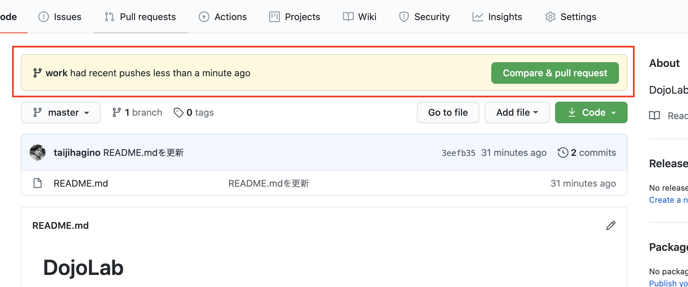

プルリクエストの作成ページが開きます。プルリクエストとは、変更を確認してマージしてくださいという依頼のことです。<br>
**Create pull request** ボタンをクリックしてください。

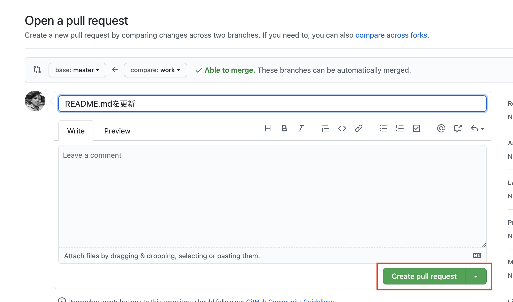

Pull requestタブに遷移するので、緑色の **Merge pull request** ボタンをクリックしてください。これは、送られてきたプルリクエストを確認したのでマージしますよ、という意思表示になります。

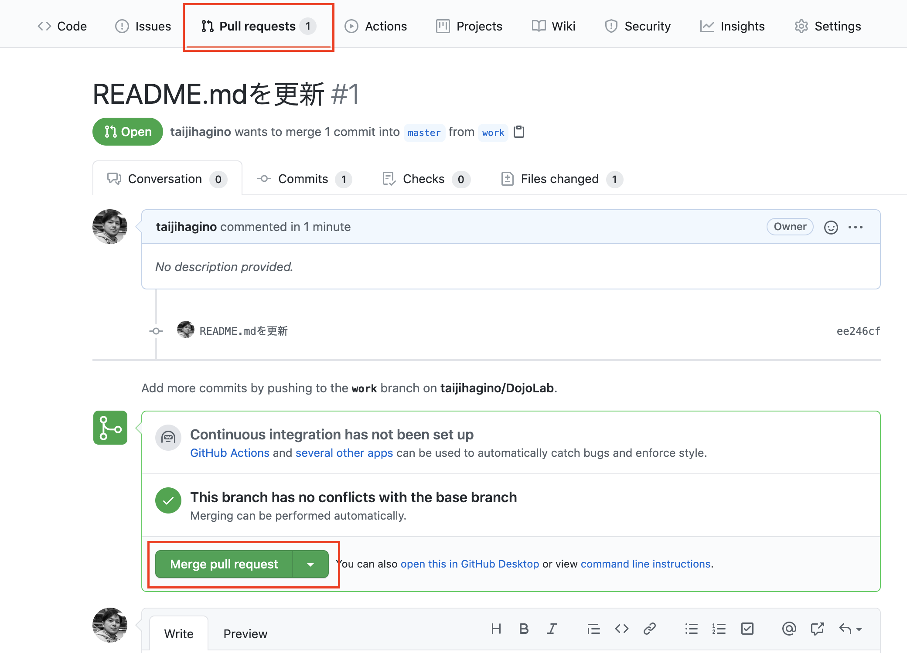

マージすることの最終確認になります。緑色の **Confirm merge** ボタンをクリックしてください。このボタンを押すことで、workブランチからのプルリクエストがmasterへ反映されることになります。

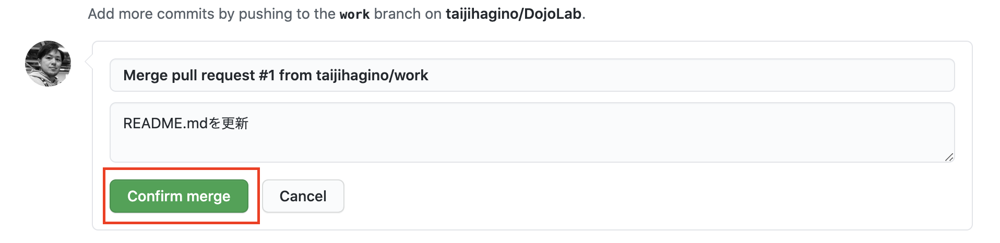

マージが完了しました。プルリクエスト画面の表示が紫色で **Merged** となっていることが確認できますね。

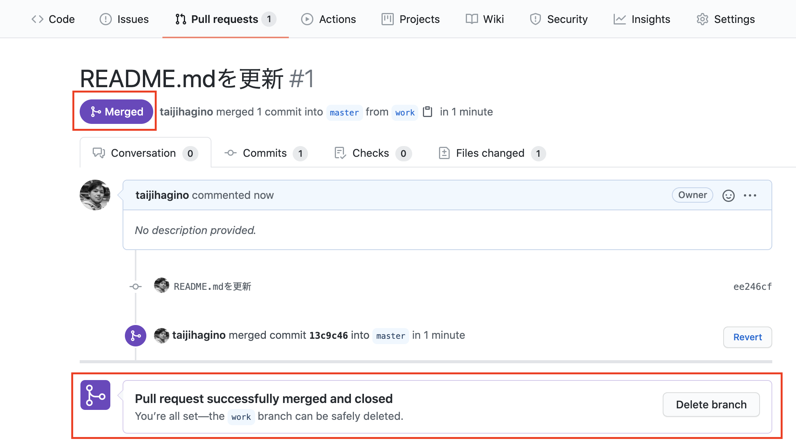

CodeタブからREADME.mdを確認してみましょう。

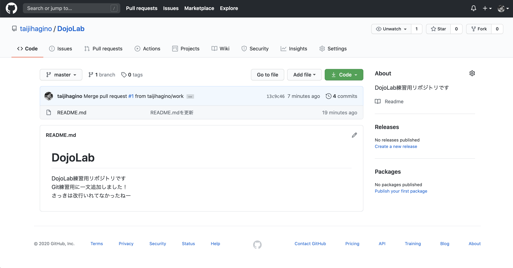

以上が、ローカルからリモートへの変更内容の反映依頼と、その反映確定の手順となります。

### 4-12. 作業用ブランチの削除
最後に、これは必須ではないですが、基本的に作業用ブランチというのは一時的なものですから、必要がなくなったら削除することが好ましいです。でないとゴミブランチがたくさん残ってしまいますからね。

#### 4-12-1. リモートブランチの削除
Code画面の **branches** タブをクリックします。

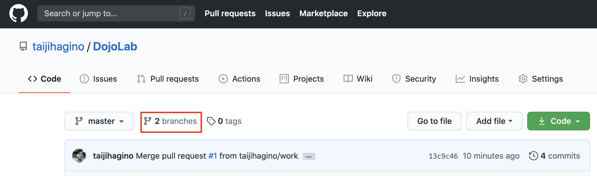


 **ゴミ箱** ボタンがあるので、これでリモートの作業用ブランチを削除することが可能です。

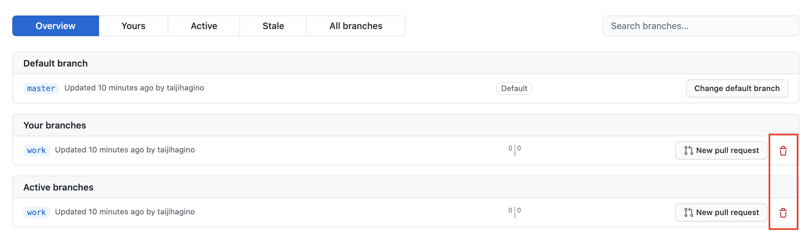

#### 4-12-2. ローカルブランチの削除
ターミナルへ戻り、ブランチをマスターへ切り替えます。masterをチェックアウトしてください。

```
$ git checkout master
Switched to branch 'master'
Your branch is up to date with 'origin/master'.
```

ブランチを確認します。

```
$ git branch
* master
  work
```

masterへいることを確認したら、workブランチを削除します。<br>
ここでは、まず以下のコマンドを実行しましょう。

```
git branch -d work
error: The branch 'work' is not fully merged.
If you are sure you want to delete it, run 'git branch -D work'.
```

おそらく上記のようなエラーになったと思います。これは、workブランチで作業した内容がローカルのmasterへ反映していないことが原因です。<br>
ここで、一旦masterへマージしてからworkを削除しましょう。

```
$ git merge work
Updating 3eefb35..ee246cf
Fast-forward
 README.md | 5 +++--
 1 file changed, 3 insertions(+), 2 deletions(-)
```

そうしたら、再度以下のコマンドを実行します。

```
$ git branch -d work
Deleted branch work (was ee246cf).
```

今度は問題なく削除できたと思います。<br>
これで、基礎的なGitの操作を一通りやってみることができました。

### 5. まとめ
いかがでしたでしょうか。なんとなくで良いので、Gitでの作業の「流れ」を少しでも分かるようになったのでしたら、本演習は成功かなと思います。

Gitの利用シナリオは他にもあるのですが、一気に全て覚えようとすると頭がこんがらがってしまうので、今回は基礎となる操作に焦点を合わせて演習を行いました。この内容が理解できるようになりましたら、次は管理権限の無い他人のリポジトリに対してコントリビュートする手順などを覚えていくと良いと思います。(Forkなどの新しい概念が登場します)

コンテンツ内容は注意して作成しているつもりではありますが、お気づきの点や間違っている内容のご指摘等がありましたら、Issueを上げていただけますと助かります。
